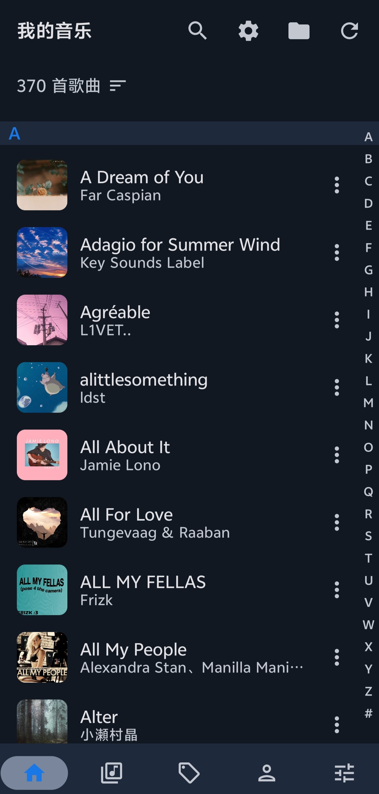
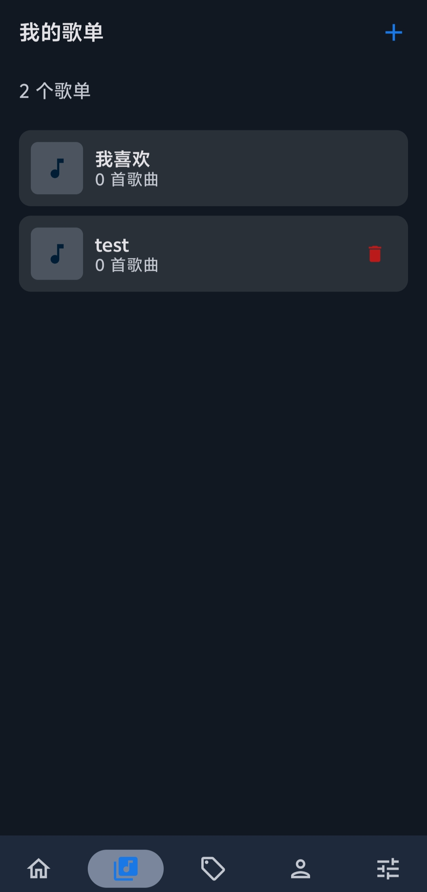
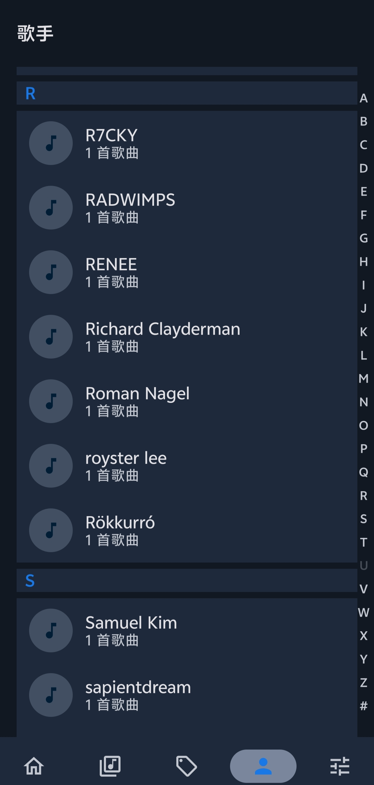
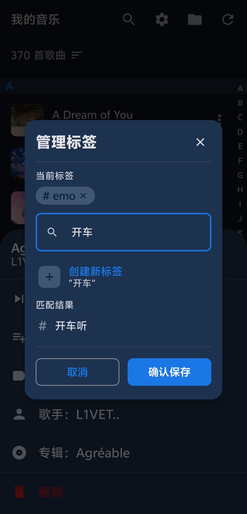
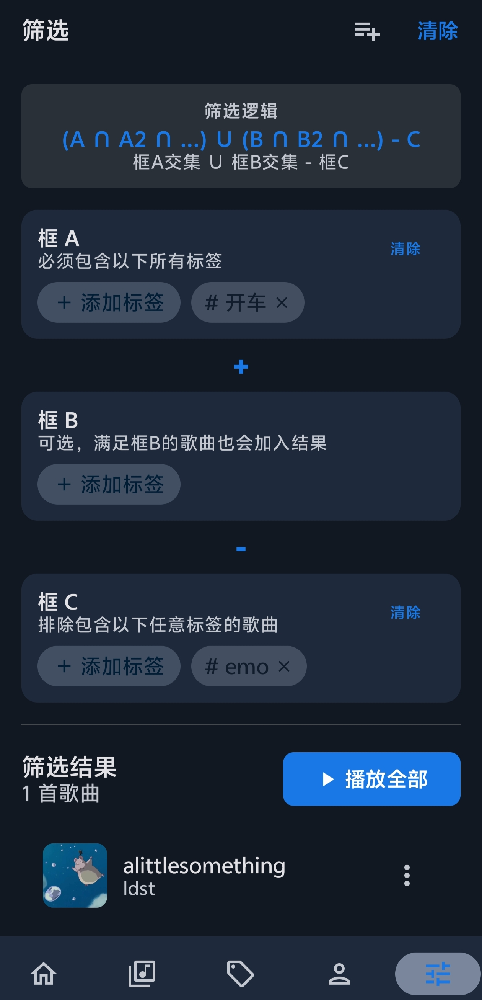
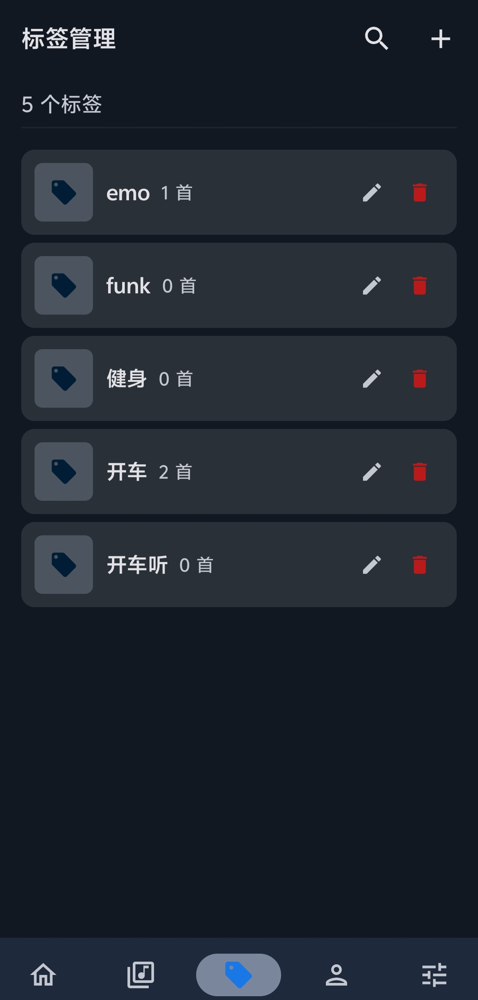

<div align="center">


# 标签化音乐播放器


**一款基于标签管理的 Android 本地音乐播放器，支持灵活的布尔运算筛选**

</div>

---

## ✨ 项目初衷

传统的歌单管理方式存在局限性：一首歌只能属于一个歌单，分类方式单一且不够灵活。

本项目尝试用**标签化管理**来解决这个痛点：
- 一首歌可以拥有多个标签（如"华语"、"运动"、"收藏"）
- 通过布尔运算（交集、并集、差集）组合筛选
- 例如：`(华语 ∩ 运动) ∪ (英文 ∩ 收藏) - 已删除`

这种管理方式更加多元、灵活，让音乐分类不再受限于单一维度。

## 🎯 功能特性

### 核心功能
- **标签管理**：为歌曲添加多个标签，支持颜色自定义
- **布尔筛选**：使用交集(A∩B)、并集(A∪B)、差集(A-B)组合筛选
- **歌单功能**：传统歌单管理，支持"我喜欢"收藏
- **歌手浏览**：按首字母分组，右侧字母索引导航

### 播放功能
- 后台播放
- 播放队列管理、拖拽排序
- 随机播放、单曲循环
- LRC 歌词显示（支持内嵌歌词、双语歌词）

### 其他功能
- 深色/浅色主题切换
- 数据备份与导入（JSON 格式）
- 自定义扫描文件夹
- 首页默认排序设置

## 📱 截图

<div align="center" style="overflow-x: auto; white-space: nowrap;">








</div>

## 🛠️ 技术栈


## 🤖 开发工具

本项目由编程零基础的开发者，借助 AI 辅助完成：

- **IDE**: Android Studio
- **AI 助手**: Claude Code + GLM-5 & Kimi-2.5

## ⚠️ 已知问题

由于开发者编程基础有限，部分功能实现不够完善：

- 🎤 歌词页面：长歌词换行、同步精度等问题
- 📀 专辑页面：已移除（功能合并到其他页面）

后续有精力的话会慢慢修改完善。

## 📂 项目结构

```
app/src/main/java/com/tagplayer/musicplayer/
├── data/                    # 数据层
│   ├── local/               # 本地数据库
│   │   ├── entity/          # 实体类
│   │   └── database/        # DAO
│   └── repository/          # 数据仓库
├── player/                  # 播放器核心
├── ui/                      # UI 层
│   ├── home/                # 首页
│   ├── playlist/            # 歌单
│   ├── tags/                # 标签
│   ├── filter/              # 筛选
│   ├── artist/              # 歌手
│   ├── player/              # 播放器
│   └── settings/            # 设置
└── util/                    # 工具类
```

## 📄 开源协议

本项目采用 [MIT License](LICENSE) 开源协议。

## 💬 致谢与说明

这个项目的创意源于我对音乐管理的实际需求。如果你也觉得标签化管理是个好主意，欢迎：

- ⭐ Star 本项目
- 🍴 Fork 并完善它
- 💡 提交 Issue 或 PR 提出建议

如果你是大佬，认可这个灵感，非常欢迎帮助完善这个项目。我只想用上这个功能，如果有人能把它做得更好，那再好不过了。

---

**声明**：本项目代码由 AI 辅助生成，质量可能不尽如人意，请多包涵。